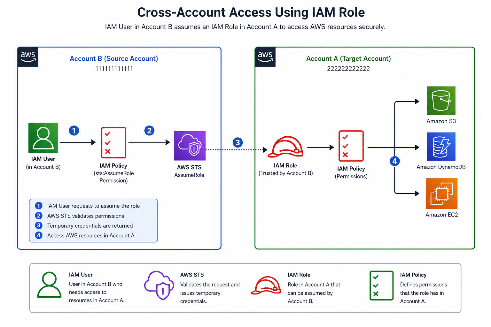

# 🧪 Lab 05 - Configure Cross-Account IAM Role Access

## 📖 Lab Information

| Property | Value |
|----------|-------|
| **Category** | AWS Identity & Access Management |
| **Level** | 🟡 Intermediate |
| **Estimated Time** | 25–30 Minutes |
| **AWS Services** | IAM, AWS STS |

---

## 🎯 Objective

Configure cross-account access using an IAM Role, allowing an IAM User in one AWS account to securely access resources in another AWS account without creating duplicate IAM Users or sharing long-term credentials.

---

## 📋 Prerequisites

- Two AWS Accounts
  - **Account A** (Target Account)
  - **Account B** (Source Account)
- Administrator permissions in both accounts
- IAM User in Account B

---

## 🏗️ Architecture

<p align="center">
  
</p>

**Figure:** Cross-account access using an IAM Role. An IAM User in **Account B** assumes a trusted IAM Role in **Account A** using AWS STS to obtain temporary credentials and securely access authorized AWS resources.


---

## ⚙️ Implementation Steps

### Account A (Target Account)

1. Create an IAM Policy with the required permissions.
2. Create an IAM Role.
3. Select **AWS Account** as the trusted entity.
4. Configure the Trust Policy to trust **Account B**.
5. Attach the IAM Policy to the IAM Role.

---

### Account B (Source Account)

1. Create an IAM Policy allowing:

```json
{
  "Effect": "Allow",
  "Action": "sts:AssumeRole",
  "Resource": "arn:aws:iam::<Account-A-ID>:role/<Role-Name>"
}
```

2. Attach the policy to the IAM User.

---

### Switch Role

1. Sign in to **Account B** using the IAM User.
2. Select **Switch Role** from the AWS Management Console.
3. Enter:
   - Account ID
   - Role Name
4. Switch to the IAM Role in **Account A**.

---

## ✅ Validation

Verify the following:

- The IAM User can successfully switch to the target account.
- Temporary credentials are issued automatically.
- Only the permissions defined in the IAM Role are available.
- Resources outside the assigned permissions remain inaccessible.

---

## 💻 Commands Used *(Optional)*

Verify the current identity:

```bash
aws sts get-caller-identity --profile account-b
```

Assume the IAM Role:

```bash
aws sts assume-role \
    --role-arn arn:aws:iam::<Account-A-ID>:role/<Role-Name> \
    --role-session-name cross-account-session
```

---

## 🎯 Result

Successfully configured secure cross-account access using an IAM Role. The IAM User in **Account B** was able to access authorized resources in **Account A** without requiring long-term credentials or creating an additional IAM User.

---

## 💡 Lessons Learned

- IAM Roles provide temporary credentials using AWS Security Token Service (STS).
- Cross-account IAM Roles eliminate the need for duplicate IAM Users.
- Trust Policies determine **who can assume a role**.
- IAM Policies determine **what actions the assumed role can perform**.
- Temporary credentials improve security by reducing credential management.

---

## ❓ Frequently Asked Question

### Why use IAM Roles instead of creating IAM Users in multiple AWS accounts?

Using IAM Roles provides several advantages:

- Eliminates duplicate IAM Users
- Uses temporary credentials instead of long-term access keys
- Simplifies identity management
- Improves security
- Supports AWS Organizations and multi-account environments

---

## 🔗 Related Documentation

- [IAM Roles](../README.md#-iam-roles)
- [Cross-Account Access](../README.md#-cross-account-access)
- [AWS Security Token Service (STS)](../README.md#-cross-account-access)

---

## 📚 References

- AWS IAM Roles  
  https://docs.aws.amazon.com/IAM/latest/UserGuide/id_roles.html

- AWS Security Token Service (STS)  
  https://docs.aws.amazon.com/STS/latest/APIReference/

- Cross-Account IAM Roles  
  https://docs.aws.amazon.com/IAM/latest/UserGuide/tutorial_cross-account-with-roles.html