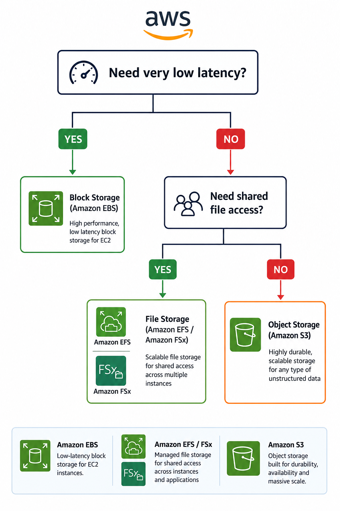

# 💾 AWS Storage Options

> Learn the three primary storage options available in AWS and understand when to use each one based on application requirements.

---

# 📖 Overview

AWS provides multiple storage services to meet different application requirements. Choosing the appropriate storage type depends on factors such as performance, scalability, cost, access patterns, and data organization.

AWS storage solutions can be categorized into three primary types:

- **Block Storage**
- **File Storage**
- **Object Storage**

Each storage type is optimized for specific workloads and use cases.

---

# 📊 Storage Comparison

| Storage Type | Best For | AWS Services |
|--------------|----------|--------------|
| **Block Storage** | Databases, Virtual Machines, High-performance applications | Amazon EBS |
| **File Storage** | Shared file systems, Collaboration, Content management | Amazon EFS, Amazon FSx |
| **Object Storage** | Images, Videos, Backups, Data Lakes, Static Websites | Amazon S3 |

---

# 📦 Block Storage

## What is Block Storage?

Block Storage stores data as fixed-size blocks. Each block is addressed independently, while the operating system organizes these blocks into files using a file system such as **NTFS**, **ext4**, or **XFS**.

Unlike file storage, block storage does not organize data into files or directories on its own.

### AWS Service

- Amazon Elastic Block Store (Amazon EBS)

---

## Why Use Block Storage?

Block storage is designed for workloads that require:

- Low latency
- High IOPS (Input/Output Operations Per Second)
- Frequent read/write operations
- High performance

Typical workloads include:

- Databases
- EC2 boot volumes
- Enterprise applications
- Virtual machines

---

## Advantages

- High performance
- Low latency
- Excellent for transactional workloads
- Supports random read/write operations

---

## Limitations

- Requires a file system to organize data
- Not designed for sharing across many systems
- Can become more complex to manage at scale

---

## Best Practices

- Use Block Storage for workloads requiring high performance and low latency.
- Choose the appropriate EBS volume type based on workload requirements.
- Monitor volume performance and utilization using Amazon CloudWatch.

---

## Key Takeaway

> Block Storage provides low-latency, high-performance storage for applications such as databases and EC2 instances. It stores data as blocks and relies on the operating system to organize the data into files.

---

# 📁 File Storage

## What is File Storage?

File Storage organizes data into directories and files using a hierarchical file system.

Multiple users or applications can access the same shared file system simultaneously.

### AWS Services

- Amazon Elastic File System (Amazon EFS) – Linux
- Amazon FSx for Windows File Server – Windows

---

## Why Use File Storage?

File Storage is ideal when multiple users or applications need shared access to files.

Typical workloads include:

- Shared application data
- Team collaboration
- Home directories
- Content management systems
- Web servers

---

## Advantages

- Familiar file system structure
- Supports shared access
- Easy collaboration
- Standard file permissions

---

## Limitations

- Less scalable than object storage for massive datasets
- Managing deep directory structures can become complex

---

## Best Practices

- Organize files using a consistent directory structure.
- Apply appropriate file permissions.
- Grant only the permissions required by users and applications.

---

## Key Takeaway

> File Storage is best suited for shared file systems where multiple users or applications need simultaneous access to the same files.

---

# 🗂 Object Storage

## What is Object Storage?

Object Storage stores data as individual objects inside logical containers called **buckets**.

Each object consists of:

- Object Data
- Metadata
- Unique Object Key

Unlike file storage, Object Storage uses a **flat namespace** instead of hierarchical folders.

### AWS Service

- Amazon Simple Storage Service (Amazon S3)

---

## Why Use Object Storage?

Object Storage is designed for storing massive amounts of unstructured data.

Typical workloads include:

- Images
- Videos
- Documents
- Log files
- Backups
- Data Lakes
- Static Website Hosting

---

## Advantages

- Virtually unlimited scalability
- High durability (99.999999999%)
- Cost-effective
- Built-in redundancy across multiple Availability Zones
- Rich metadata support

---

## Limitations

- Not suitable for databases
- Cannot host or execute applications
- Not ideal for workloads requiring block-level access

---

## Best Practices

- Use Object Storage for unstructured data.
- Apply the Principle of Least Privilege using IAM and Bucket Policies.
- Enable Versioning for important data.
- Configure Lifecycle Rules to optimize storage costs.

---

## Key Takeaway

> Object Storage is ideal for storing massive amounts of unstructured data. Amazon S3 provides virtually unlimited scalability, high durability, and cost-effective storage while supporting features such as Versioning, Lifecycle Management, and Replication.

---

# 📊 Storage Type Comparison

| Feature | Block Storage | File Storage | Object Storage |
|----------|--------------|--------------|----------------|
| Data Structure | Blocks | Files & Directories | Objects |
| Access Method | Attached Volume | Shared File System | HTTP / API |
| Scalability | Medium | High | Virtually Unlimited |
| Performance | Very High | High | High |
| Latency | Very Low | Low | Low |
| Shared Access | No | Yes | Yes |
| Metadata | Limited | Standard File Metadata | Rich Metadata |
| Best For | Databases, EC2 | Shared Files | Images, Videos, Backups |

---

# 🎯 Choosing the Right Storage

  

---

# ❓ Interview Questions

### Q1. Which AWS storage service is best for a relational database?

**Answer:**

Amazon Elastic Block Store (Amazon EBS), because databases require low-latency block-level storage with frequent read/write operations.

---

### Q2. Which AWS storage service is best for storing millions of images?

**Answer:**

Amazon S3, because it provides virtually unlimited scalability, high durability, and cost-effective object storage.

---

### Q3. Which AWS storage service allows multiple EC2 instances to access the same files?

**Answer:**

Amazon Elastic File System (Amazon EFS).

---

### Q4. Which AWS storage service can be used as an EC2 boot volume?

**Answer:**

Amazon Elastic Block Store (Amazon EBS).

---

### Q5. Which AWS storage type provides the highest scalability?

**Answer:**

Object Storage (Amazon S3).

---

# 💡 Key Takeaways

- **Block Storage** is best for databases and high-performance applications.
- **File Storage** is ideal for shared file systems and collaboration.
- **Object Storage** is designed for storing massive amounts of unstructured data.
- Choosing the correct storage type improves application performance, scalability, and cost efficiency.

---

# 📚 Related Topics

- [Amazon S3](02-amazon-s3.md)
- [Amazon S3 Storage Classes](03-storage-classes.md)

---

# 📖 References

- https://docs.aws.amazon.com/AmazonS3/latest/userguide/Welcome.html
- https://docs.aws.amazon.com/ebs/
- https://docs.aws.amazon.com/efs/
- https://docs.aws.amazon.com/fsx/