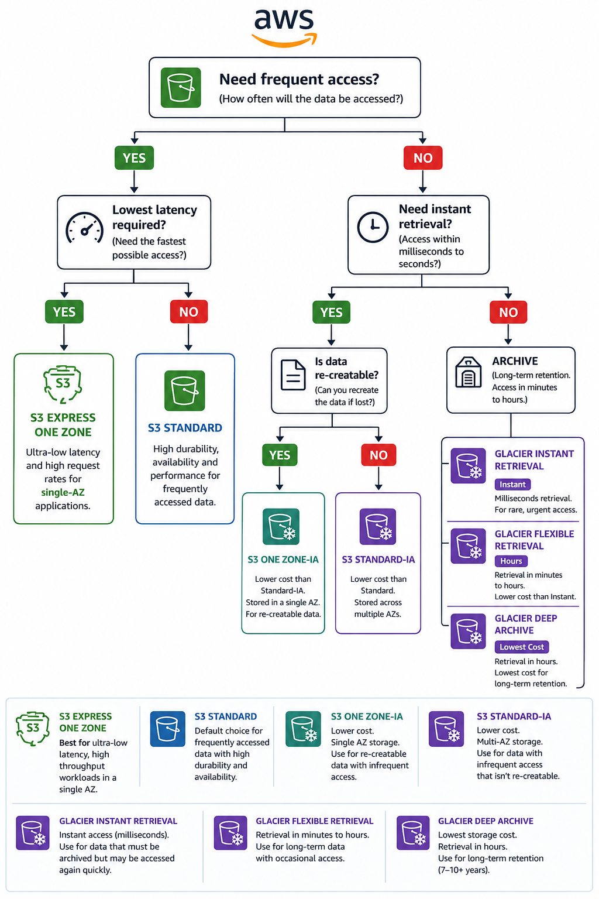

# 💾 Amazon S3 Storage Classes

> Learn how Amazon S3 Storage Classes help optimize storage costs based on data access patterns, performance requirements, and availability.

---

# 📖 Overview

Amazon S3 offers multiple **Storage Classes** to store objects based on how frequently they are accessed and how quickly they need to be retrieved.

Choosing the correct storage class helps balance:

- Performance
- Availability
- Retrieval time
- Storage cost
- Data access patterns

> **Important:** Storage Classes are assigned at the **object level**, not the bucket level. A single bucket can contain objects from multiple storage classes.

---

# 🎯 Learning Objectives

After completing this topic, you should understand:

- What Storage Classes are
- Differences between each Storage Class
- When to use each Storage Class
- Cost optimization strategies
- Best practices
- Interview concepts

---

# 🏗 Storage Classes

Amazon S3 currently provides the following storage classes:

- S3 Standard
- S3 Standard-Infrequent Access (Standard-IA)
- S3 One Zone-IA
- S3 Glacier Instant Retrieval
- S3 Glacier Flexible Retrieval
- S3 Glacier Deep Archive
- S3 Intelligent-Tiering
- S3 Express One Zone

---

# 📦 S3 Standard

## What?

Amazon S3 Standard is the **default storage class** and is designed for **frequently accessed data**.

### Characteristics

- Default storage class
- Multi-AZ storage
- Millisecond retrieval
- 99.999999999% (11 nines) durability
- High availability
- No minimum storage duration
- Charges for storage, requests, and data transfer out

### Typical Use Cases

- Websites
- Mobile applications
- Frequently accessed images
- Business applications
- Active datasets

### Best Practices

- Use for frequently accessed data.
- Minimize unnecessary internet data transfer to reduce costs.

### Key Takeaway

> S3 Standard is ideal for data that requires frequent, low-latency access.

---

# 📦 S3 Standard-Infrequent Access (Standard-IA)

## What?

Designed for data that is accessed less frequently but still requires **millisecond retrieval**.

### Characteristics

- Multi-AZ storage
- Instant retrieval
- Lower storage cost
- Retrieval charges apply
- 30-day minimum storage duration
- 128 KB minimum billable object size

### Typical Use Cases

- Monthly reports
- Backup files
- Disaster recovery copies
- Long-term project documents

### Best Practices

- Use only for infrequently accessed data.
- Avoid using it for frequently accessed workloads due to retrieval charges.

### Key Takeaway

> Lower storage cost than S3 Standard while maintaining instant access.

---

# 📦 S3 One Zone-Infrequent Access

## What?

Stores data in a **single Availability Zone** for lower storage cost.

### Characteristics

- Single AZ
- Instant retrieval
- Lower storage cost
- Retrieval charges apply
- 30-day minimum storage duration

### Typical Use Cases

- Secondary backups
- Re-creatable data
- Temporary datasets

### Best Practices

- Do not use for critical or irreplaceable data.
- Use only when data can be recreated if necessary.

### Key Takeaway

> Lowest-cost IA option for data that can be recreated.

---

# 🧊 S3 Glacier Instant Retrieval

## What?

Designed for **archival data** that is rarely accessed but still requires **instant retrieval**.

### Characteristics

- Multi-AZ storage
- Millisecond retrieval
- Lower storage cost
- 90-day minimum storage duration

### Typical Use Cases

- Medical images
- Archived media
- Historical documents

### Best Practices

- Store archival data that still needs immediate access.

### Key Takeaway

> Archive storage with instant retrieval performance.

---

# 🧊 S3 Glacier Flexible Retrieval

## What?

Designed for long-term archival where retrieval time can vary.

### Retrieval Options

| Retrieval Type | Time |
|---------------|------|
| Expedited | 1–5 Minutes |
| Standard | 3–5 Hours |
| Bulk | 5–12 Hours |

### Characteristics

- Multi-AZ storage
- 90-day minimum storage duration
- Retrieval process required

### Typical Use Cases

- Compliance archives
- Backup archives
- Long-term storage

### Best Practices

- Choose the appropriate retrieval option based on business requirements.

### Key Takeaway

> Lower-cost archival storage where retrieval can take minutes or hours.

---

# 🧊 S3 Glacier Deep Archive

## What?

The **lowest-cost** Amazon S3 storage class designed for long-term archival.

### Retrieval Options

| Retrieval Type | Time |
|---------------|------|
| Standard | Up to 12 Hours |
| Bulk | Up to 48 Hours |

### Characteristics

- Multi-AZ storage
- 180-day minimum storage duration
- Lowest storage cost

### Typical Use Cases

- Regulatory compliance
- Financial records
- Medical records
- Long-term backups

### Key Takeaway

> Cheapest storage class for data that is rarely accessed.

---

# 🤖 S3 Intelligent-Tiering

## What?

Automatically moves objects between storage tiers based on changing access patterns.

### Characteristics

- Automatic tiering
- No retrieval charges for frequent tiers
- Small monitoring and automation fee
- Cost optimization

### Typical Use Cases

- Unknown access patterns
- Variable workloads
- Long-term datasets

### Best Practices

- Use when access patterns are unpredictable.
- Monitor object counts because monitoring fees apply.

### Key Takeaway

> Automatically optimizes storage costs without impacting application performance.

---

# ⚡ S3 Express One Zone

## What?

High-performance storage class providing the **lowest latency** available in Amazon S3.

### Characteristics

- Single Availability Zone
- Single-digit millisecond latency
- High request performance
- Directory Buckets

### Typical Use Cases

- AI / ML model training
- Real-time analytics
- Financial simulations
- Media rendering

### Best Practices

- Use only when ultra-low latency is required.
- Consider durability requirements because data is stored in one Availability Zone.

### Key Takeaway

> Best storage class for latency-sensitive workloads.

---

# 📊 Storage Class Comparison

| Storage Class | Access Pattern | Retrieval | Availability | Best For |
|---------------|---------------|-----------|-------------|----------|
| Standard | Frequent | Milliseconds | Multi-AZ | Active Applications |
| Standard-IA | Infrequent | Milliseconds | Multi-AZ | Backups |
| One Zone-IA | Infrequent | Milliseconds | Single AZ | Secondary Backups |
| Glacier Instant | Rare | Milliseconds | Multi-AZ | Archived Data |
| Glacier Flexible | Rare | Minutes–Hours | Multi-AZ | Compliance |
| Glacier Deep Archive | Very Rare | Hours | Multi-AZ | Long-term Archive |
| Intelligent-Tiering | Unknown | Automatic | Multi-AZ | Variable Workloads |
| Express One Zone | Frequent | Single-digit ms | Single AZ | AI / ML |

---

# 🌳 Storage Class Selection Guide

  

---

# ❓ Frequently Asked Questions

### Q1. When should you use Standard-IA instead of Standard?

Use Standard-IA when data is accessed infrequently but still requires instant retrieval.

---

### Q2. Which storage class is the cheapest?

Amazon S3 Glacier Deep Archive.

---

### Q3. Which storage class automatically changes storage tiers?

Amazon S3 Intelligent-Tiering.

---

### Q4. Can a bucket contain multiple storage classes?

Yes. Storage Classes are assigned at the object level, so a bucket can contain objects from multiple storage classes.

---

### Q5. Which storage class is best for AI/ML workloads requiring the lowest latency?

Amazon S3 Express One Zone.

---

# 💡 Key Takeaways

- Storage Classes optimize cost based on access patterns.
- Standard is designed for frequently accessed data.
- Standard-IA and One Zone-IA reduce costs for infrequently accessed data.
- Glacier classes are designed for archival storage.
- Intelligent-Tiering automatically optimizes storage costs.
- Express One Zone provides the lowest latency for performance-sensitive workloads.

---

# 📚 Related Topics

- [Amazon S3](02-amazon-s3.md)
- [Amazon S3 Versioning](04-versioning.md)
- [Amazon S3 Replication](05-replication.md)

---

# 📖 References

- AWS S3 Storage Classes Documentation
- AWS S3 Pricing
- AWS Well-Architected Framework – Cost Optimization Pillar