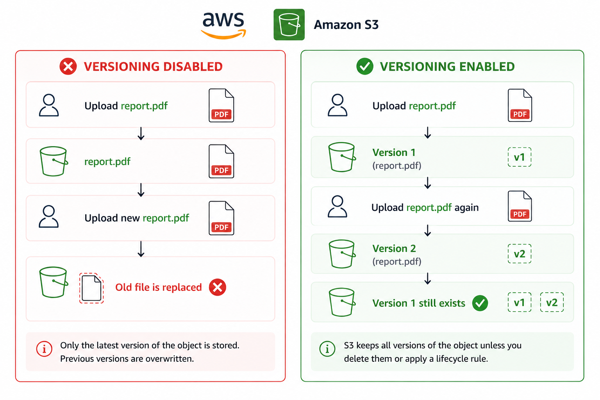
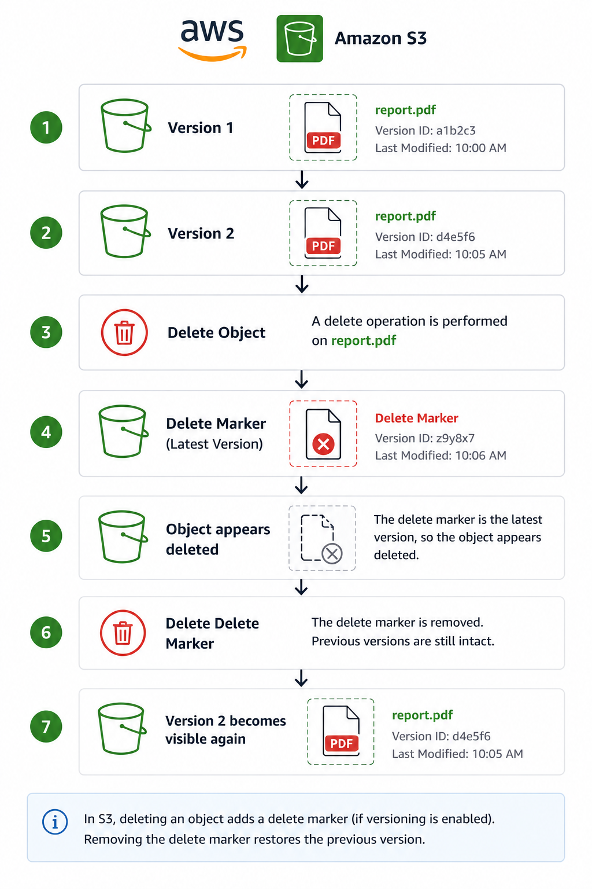

# 📌 Amazon S3 Versioning

> Learn how Amazon S3 Versioning protects objects against accidental deletion and unintended overwrites by maintaining multiple versions of an object.

---

# 📖 Overview

Amazon S3 Versioning is a bucket-level feature that preserves multiple versions of an object over time.

Instead of permanently replacing or deleting an object, Amazon S3 keeps previous versions, making it possible to recover data that was accidentally deleted or overwritten.

Versioning is one of the most commonly used features for improving data protection and disaster recovery.

---

# 🎯 Learning Objectives

After completing this topic, you should understand:

- What S3 Versioning is
- Why Versioning is important
- How Versioning works
- Delete Marker behavior
- Production best practices
- Interview concepts

---

# 🔄 What is Versioning?

Amazon S3 Versioning is a feature that preserves multiple versions of an object within a bucket.

When Versioning is enabled:

- Uploading an object with the same key creates a **new version** instead of replacing the existing object.
- Previous versions remain available until they are permanently deleted.
- Accidental deletions can be recovered.

---

# ❓ Why Use Versioning?

Versioning helps protect against:

- Accidental deletion
- Accidental overwrite
- Data corruption
- Human error

It also allows organizations to maintain historical versions of important files.

Without Versioning, an uploaded object simply replaces the previous one.

---

# ⚙️ How Versioning Works
<p align="center">
  
</p>

---

# 🗑 Delete Marker

When Versioning is enabled, deleting an object without specifying a version ID **does not permanently remove the object**.

Instead, Amazon S3 creates a **Delete Marker**.

The latest version becomes hidden, while previous versions remain stored.
<p align="center">
  
</p>


---

# ⭐ Key Characteristics

- Versioning is **disabled by default**.
- Once enabled, it **cannot be permanently disabled**.
- Versioning can only be **suspended**.
- Every upload of the same object creates a new version.
- Previous versions continue to exist until permanently removed.
- Delete operations create a Delete Marker instead of deleting object versions.

---

# 💼 Common Use Cases

Amazon S3 Versioning is commonly used for:

- Production application data
- Backup repositories
- Configuration files
- Source code archives
- Business documents
- Compliance requirements

---

# 🔒 Best Practices

- Enable Versioning for production buckets.
- Combine Versioning with Lifecycle Rules to automatically remove obsolete versions.
- Monitor storage usage because every version is stored and billed.
- Enable Cross-Region Replication (CRR) if disaster recovery across Regions is required.
- Protect critical buckets using MFA Delete (where applicable).

---

# ⚠ Cost Considerations

Every object version is stored as a separate object.

Example:

```text
report.pdf Version 1

10 MB

+

report.pdf Version 2

10 MB

=

20 MB billed
```

For this reason, Versioning should typically be combined with Lifecycle Rules to automatically delete old object versions that are no longer required.

---

# 📊 Without Versioning vs With Versioning

| Feature | Without Versioning | With Versioning |
|----------|-------------------|-----------------|
| Accidental Overwrite | Previous version lost | Previous version preserved |
| Accidental Delete | Object permanently deleted | Delete Marker created |
| Object Recovery | Not possible | Possible |
| Historical Versions | No | Yes |

---

# ❓ Frequently Asked Questions

### Q1. Can Amazon S3 Versioning be disabled?

**Answer**

No.

After Versioning is enabled, it cannot be permanently disabled.

It can only be suspended.

---

### Q2. What happens when you upload the same object again?

**Answer**

Amazon S3 creates a new object version instead of replacing the existing object.

---

### Q3. What happens when you delete an object in a version-enabled bucket?

**Answer**

Amazon S3 creates a Delete Marker.

Previous object versions remain stored.

---

### Q4. How do you recover a deleted object?

**Answer**

Delete the Delete Marker or restore a previous object version.

---

### Q5. Why should Lifecycle Rules be configured with Versioning?

**Answer**

Every object version is billed separately.

Lifecycle Rules automatically remove old versions to reduce storage costs.

---

### Q6. Does Versioning protect against accidental overwrites?

**Answer**

Yes.

Instead of replacing the existing object, Amazon S3 creates a new object version while preserving previous versions.

---

# 💡 Key Takeaways

- Versioning protects against accidental deletion and overwrites.
- Previous versions remain available for recovery.
- Delete operations create Delete Markers instead of permanently removing objects.
- Every version is billed separately.
- Lifecycle Rules should be configured to optimize storage costs.

---

# 🧪 Related Lab

**Lab 02 – Enable Amazon S3 Versioning**

In this lab you will:

- Enable Versioning on an existing bucket
- Upload multiple versions of an object
- Validate object versions
- Observe Delete Marker behavior
- Restore an object by removing the Delete Marker

---

# 🔗 Related Topics

- [Amazon S3](02-amazon-s3.md)
- [Amazon S3 Storage Classes](03-storage-classes.md)
- [Amazon S3 Replication](05-replication.md)

---

# 📖 References

- AWS Documentation – Amazon S3 Versioning
- AWS Documentation – Delete Markers
- AWS Well-Architected Framework – Reliability Pillar