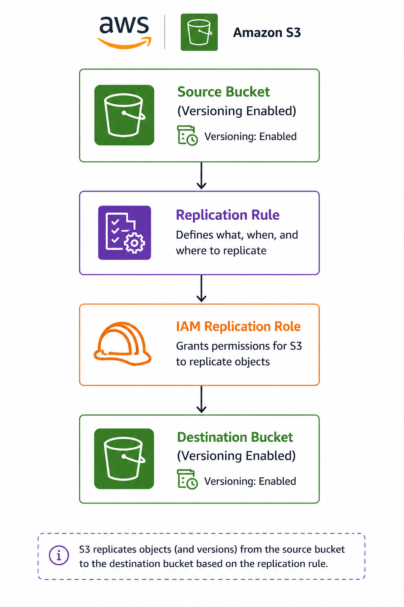

# 🔄 Amazon S3 Replication

> Learn how Amazon S3 Replication automatically copies objects between buckets to improve data availability, disaster recovery, compliance, and operational efficiency.

---

# 📖 Overview

Amazon S3 Replication is a feature that automatically and asynchronously copies objects from a **source bucket** to a **destination bucket**.

Replication helps organizations improve data availability, implement disaster recovery strategies, meet compliance requirements, and optimize data access across multiple AWS Regions or AWS accounts.

Amazon S3 supports:

- Same-Region Replication (SRR)
- Cross-Region Replication (CRR)

Both replication types can also be configured across different AWS accounts.

---

# 🎯 Learning Objectives

After completing this topic, you should understand:

- What Amazon S3 Replication is
- Replication prerequisites
- Same-Region Replication (SRR)
- Cross-Region Replication (CRR)
- Cross-Account Replication
- Replication Time Control (RTC)
- Production best practices
- Interview concepts

---

# 🔄 What is Amazon S3 Replication?

Amazon S3 Replication automatically creates copies of objects from one bucket to another.

Replication occurs **asynchronously**, meaning new objects are copied shortly after they are uploaded to the source bucket.

It helps organizations:

- Improve availability
- Meet disaster recovery requirements
- Satisfy compliance requirements
- Reduce latency for global users

---

# 📋 Prerequisites

Before configuring replication:

- Versioning must be enabled on both the source and destination buckets.
- The destination bucket must already exist.
- Amazon S3 requires an IAM Role to replicate objects.
- Appropriate Bucket Policies must allow replication.
- Source and destination buckets must belong to supported AWS Regions.

---

# 🏗 How Replication Works

  

Replication occurs automatically whenever new objects are uploaded to the source bucket.

---

# 🌍 Same-Region Replication (SRR)

## What is SRR?

Same-Region Replication copies objects between buckets within the **same AWS Region**.

### Typical Use Cases

- Centralized log aggregation
- Development and production synchronization
- Compliance requirements within the same Region
- Backup where data must remain in the same Region

### Advantages

- Lower latency
- No cross-region data transfer
- Meets regional compliance requirements

---

# 🌎 Cross-Region Replication (CRR)

## What is CRR?

Cross-Region Replication copies objects between buckets located in different AWS Regions.

### Typical Use Cases

- Disaster Recovery
- Global applications
- Regulatory compliance
- Improved data access for international users

### Advantages

- Geographic redundancy
- Reduced latency for global users
- Business continuity

---

# 👥 Cross-Account Replication

Amazon S3 Replication can also copy objects between different AWS accounts.

Additional configuration includes:

- Destination Bucket Policy
- IAM Replication Role
- Cross-account permissions

Cross-account replication is commonly used by organizations that separate production, backup, or security accounts.

---

# 📌 Key Characteristics

- Replication is asynchronous.
- Versioning is required on both buckets.
- Replication can target all objects or specific prefixes/tags.
- Existing objects are **not** replicated automatically.
- Replicated objects can use a different storage class.
- Replication is **one-way** by default.
- Delete Markers are not replicated unless explicitly configured.

---

# ⏱ Replication Time Control (RTC)

Amazon S3 Replication Time Control (RTC) provides a Service Level Agreement (SLA) where:

- **99.9%** of new objects are replicated within **15 minutes**.

RTC is useful for:

- Financial applications
- Regulatory compliance
- Mission-critical workloads

---

# 📦 Replicating Existing Objects

By default, replication applies only to **new object versions**.

Existing objects can be replicated using:

**Amazon S3 Batch Replication**

This allows organizations to replicate historical data after replication has been configured.

---

# 📊 SRR vs CRR

| Feature | SRR | CRR |
|----------|:---:|:---:|
| Same AWS Region | ✅ | ❌ |
| Different AWS Region | ❌ | ✅ |
| Disaster Recovery | Limited | Excellent |
| Compliance | Same Region | Cross Region |
| Reduce Global Latency | ❌ | ✅ |
| Geographic Redundancy | ❌ | ✅ |

---

# 💼 Common Use Cases

### Same-Region Replication

- Centralized logging
- Data synchronization
- Same-region backups
- Compliance

### Cross-Region Replication

- Disaster Recovery
- Global applications
- Regulatory compliance
- International customers

### Cross-Account Replication

- Security account backups
- Multi-account AWS environments
- Centralized governance

---

# 🔒 Best Practices

- Enable Versioning before configuring replication.
- Replicate only business-critical data.
- Follow the Principle of Least Privilege for IAM Roles and Bucket Policies.
- Monitor replication status using Amazon CloudWatch.
- Use Replication Time Control (RTC) only when required due to additional costs.
- Test disaster recovery procedures regularly.

---

# ⚠ Important Considerations

- Replication is asynchronous.
- Existing objects require S3 Batch Replication.
- Replication does not automatically become bidirectional.
- Additional storage and transfer costs apply.
- Cross-Region Replication increases storage costs because copies are stored in another Region.

---

# ❓ Frequently Asked Questions

### Q1. Can replication be configured without Versioning?

**Answer**

No.

Versioning must be enabled on both the source and destination buckets.

---

### Q2. Are existing objects automatically replicated?

**Answer**

No.

Only new object versions are replicated.

Use **Amazon S3 Batch Replication** to copy existing objects.

---

### Q3. Is Amazon S3 Replication synchronous?

**Answer**

No.

Replication is asynchronous.

---

### Q4. Can replicated objects use a different storage class?

**Answer**

Yes.

The destination bucket can store replicated objects using a different storage class for cost optimization.

---

### Q5. Can replication occur between different AWS accounts?

**Answer**

Yes.

Both Same-Region Replication (SRR) and Cross-Region Replication (CRR) support cross-account replication when the required IAM Roles and Bucket Policies are configured.

---

### Q6. Does Amazon S3 automatically replicate Delete Markers?

**Answer**

No.

Delete Marker Replication must be explicitly enabled if required.

---

### Q7. What is the difference between SRR and CRR?

**Answer**

SRR replicates objects within the same AWS Region, while CRR replicates objects across different AWS Regions.

---

# 💡 Key Takeaways

- Amazon S3 Replication automatically copies objects between buckets.
- Replication improves disaster recovery, compliance, and availability.
- Versioning is mandatory for replication.
- Existing objects require Amazon S3 Batch Replication.
- SRR is designed for same-region scenarios, while CRR supports geographic redundancy.
- Replication is asynchronous and incurs additional storage costs.

---

# 🧪 Related Lab

**Lab 03 – Configure Amazon S3 Replication**

In this lab you will:

- Enable Versioning
- Configure Same-Region or Cross-Region Replication
- Create an IAM Replication Role
- Validate object replication
- Verify replication status

---

# 🔗 Related Topics

- [Amazon S3](02-amazon-s3.md)
- [Amazon S3 Storage Classes](03-storage-classes.md)
- [Amazon S3 Versioning](04-versioning.md)

---

# 📖 References

- AWS Documentation – Amazon S3 Replication
- AWS Documentation – Replication Time Control (RTC)
- AWS Documentation – S3 Batch Replication
- AWS Well-Architected Framework – Reliability Pillar