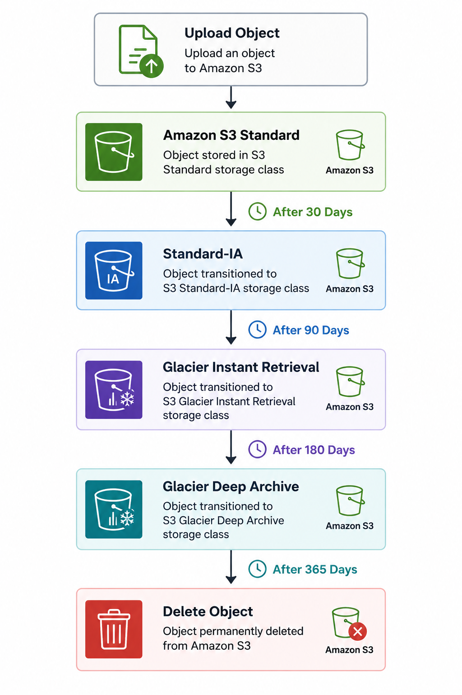

# ♻️ Amazon S3 Lifecycle Management

> Learn how Amazon S3 Lifecycle Management automatically transitions objects between storage classes and deletes obsolete data to optimize storage costs throughout an object's lifecycle.

---

# 📖 Overview

As data ages, its access patterns often change. Files that are accessed frequently today may become infrequently accessed or no longer needed in the future.

Amazon S3 Lifecycle Management helps automate this process by transitioning objects to lower-cost storage classes or permanently deleting them based on rules that you define.

Lifecycle Management reduces operational overhead while helping organizations optimize storage costs and meet data retention requirements.

---

# 🎯 Learning Objectives

After completing this topic, you should understand:

- What Amazon S3 Lifecycle Management is
- Lifecycle transition actions
- Lifecycle expiration actions
- How Lifecycle Rules work
- Common use cases
- Best practices
- Interview concepts

---

# ♻️ What is Amazon S3 Lifecycle Management?

Amazon S3 Lifecycle Management is a feature that automatically manages objects throughout their lifecycle.

Lifecycle Rules can perform two types of actions:

- **Transition**
  - Move objects to another storage class after a specified number of days.

- **Expiration**
  - Permanently delete objects or previous object versions after a specified period.

Amazon S3 continuously evaluates these rules and performs the configured actions automatically.

---

# 🏗 How Lifecycle Rules Work

  

> The above workflow is an example. Lifecycle Rules are fully customizable based on business requirements.

---

# 🔄 Transition Actions

Transition actions automatically move objects to another storage class after a specified number of days.

Example:

| After | Transition To |
|--------|---------------|
| 30 Days | Standard-IA |
| 90 Days | Glacier Instant Retrieval |
| 180 Days | Glacier Deep Archive |

Transition rules help reduce storage costs while keeping data available when needed.

---

# 🗑 Expiration Actions

Expiration rules permanently delete objects after a specified retention period.

Examples:

- Delete temporary files after 30 days.
- Delete application logs after one year.
- Delete previous object versions after 90 days.

Expiration helps organizations:

- Reduce storage costs
- Meet compliance requirements
- Remove obsolete data automatically

---

# 📦 Versioning and Lifecycle

Lifecycle Rules work seamlessly with Amazon S3 Versioning.

Common examples include:

- Delete previous object versions after 90 days.
- Delete expired Delete Markers.
- Retain only the latest object versions.

This prevents Versioning from significantly increasing storage costs over time.

---

# 💼 Common Use Cases

Amazon S3 Lifecycle Management is commonly used for:

- Backup retention
- Log management
- Compliance archives
- Temporary application files
- Static website assets
- Data lake optimization
- Cost optimization

---

# 💰 Benefits

Lifecycle Management helps organizations:

- Reduce storage costs
- Automate storage management
- Eliminate manual cleanup
- Improve operational efficiency
- Enforce data retention policies

---

# 🔒 Best Practices

- Define Lifecycle Rules based on actual data access patterns.
- Transition infrequently accessed data to lower-cost storage classes.
- Configure expiration rules for temporary or obsolete data.
- Combine Lifecycle Rules with Versioning to remove old object versions.
- Review lifecycle policies regularly to ensure they align with business and compliance requirements.
- Use Intelligent-Tiering instead of Lifecycle Rules when object access patterns are unpredictable.

---

# ⚠ Important Considerations

- Lifecycle Rules execute automatically.
- Objects transition only according to the configured rules.
- Lifecycle Rules generally move data toward lower-cost storage classes.
- Intelligent-Tiering is better suited for unpredictable access patterns.
- Storage class minimum duration charges still apply after transitions.

---

# 📊 Lifecycle Rules vs Intelligent-Tiering

| Feature | Lifecycle Rules | Intelligent-Tiering |
|----------|-----------------|---------------------|
| Rule Based | ✅ | ❌ |
| Automatic Monitoring | ❌ | ✅ |
| Predictable Access Patterns | ✅ | ❌ |
| Unknown Access Patterns | ❌ | ✅ |
| Monitoring Fee | No | Yes |

---

# ❓ Frequently Asked Questions

### Q1. What are the two actions supported by Lifecycle Rules?

**Answer**

- Transition
- Expiration

---

### Q2. Can Lifecycle Rules automatically move objects back to the Standard storage class?

**Answer**

No.

Lifecycle Rules transition objects according to the configured policy. They do not automatically move objects back to a higher-cost storage class.

---

### Q3. When should Intelligent-Tiering be used instead of Lifecycle Rules?

**Answer**

When object access patterns are unknown or unpredictable.

---

### Q4. Can Lifecycle Rules delete previous object versions?

**Answer**

Yes.

Lifecycle Rules can automatically delete previous versions when Versioning is enabled.

---

### Q5. Why are Lifecycle Rules important?

**Answer**

They reduce storage costs, automate storage management, and simplify data retention.

---

# 💡 Key Takeaways

- Lifecycle Management automates object transitions and expiration.
- Transition actions move objects to lower-cost storage classes.
- Expiration actions permanently remove obsolete data.
- Lifecycle Rules work well with Versioning to manage previous object versions.
- Intelligent-Tiering is a better option when object access patterns are unpredictable.

---

# 🧪 Related Lab

**Lab 04 – Configure Amazon S3 Lifecycle Rules**

In this lab you will:

- Create a Lifecycle Rule
- Configure Transition actions
- Configure Expiration actions
- Validate object transitions
- Review Lifecycle Rule behavior

---

# 🔗 Related Topics

- Amazon S3
- Amazon S3 Storage Classes
- Amazon S3 Versioning
- Amazon S3 Intelligent-Tiering

---

# 📖 References

- AWS Documentation – Amazon S3 Lifecycle Management  
  https://docs.aws.amazon.com/AmazonS3/latest/userguide/object-lifecycle-mgmt.html

- AWS Documentation – Lifecycle Configuration Examples  
  https://docs.aws.amazon.com/AmazonS3/latest/userguide/lifecycle-configuration-examples.html

- AWS Documentation – Storage Class Transitions  
  https://docs.aws.amazon.com/AmazonS3/latest/userguide/lifecycle-transition-general-considerations.html

- AWS Well-Architected Framework – Cost Optimization Pillar  
  https://docs.aws.amazon.com/wellarchitected/latest/framework/cost-optimization.html