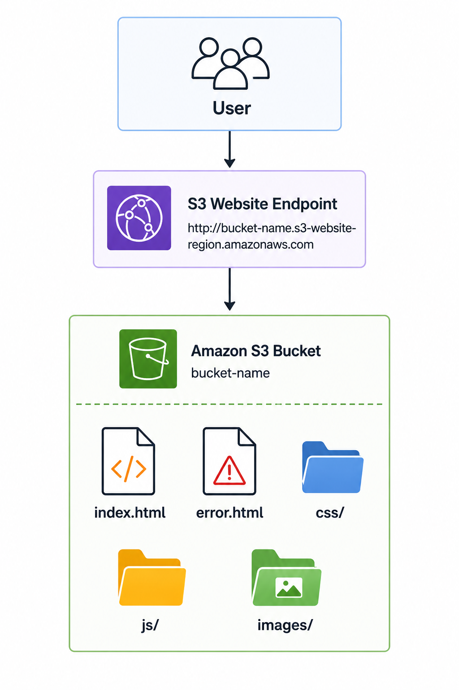

# 🌐 Amazon S3 Static Website Hosting

> Learn how Amazon S3 can host static websites without managing web servers, providing a scalable, highly available, and cost-effective hosting solution.

---

# 📖 Overview

Amazon S3 provides a built-in feature that allows you to host static websites directly from an S3 bucket.

A static website consists of files that are delivered to the user's browser without server-side processing, such as:

- HTML
- CSS
- JavaScript
- Images
- Fonts
- Videos

Because Amazon S3 is fully managed by AWS, organizations can host static websites without provisioning or maintaining web servers.

---

# 🎯 Learning Objectives

After completing this topic, you should understand:

- What Amazon S3 Static Website Hosting is
- How static website hosting works
- Common use cases
- Benefits
- Best practices
- Limitations
- Interview concepts

---

# 🌐 What is Amazon S3 Static Website Hosting?

Amazon S3 Static Website Hosting allows an S3 bucket to serve static website content over HTTP.

To host a website, you must:

- Enable **Static Website Hosting** on the bucket.
- Specify an **Index Document** (for example, `index.html`).
- Optionally configure an **Error Document** (for example, `error.html`).
- Configure a Bucket Policy to allow public read access to the website content.

Once configured, AWS provides a website endpoint that users can access through a web browser.

---

# 🏗 How Static Website Hosting Works

  

---

# ⭐ Key Characteristics

- Fully managed by AWS
- Highly scalable
- Highly available
- Supports only static content
- No server-side processing
- Website accessible through an S3 Website Endpoint
- Supports custom error pages

---

# 💼 Common Use Cases

Amazon S3 Static Website Hosting is commonly used for:

- Portfolio websites
- Product landing pages
- Company websites
- Documentation sites
- Maintenance pages
- Static assets for web applications

---

# ✅ Benefits

- Low-cost hosting solution
- No server management
- Automatic scalability
- High durability
- High availability
- Simple deployment

---

# ⚠ Important Considerations

- Amazon S3 supports **only static websites**.
- Server-side technologies such as PHP, Java, .NET, and Python cannot run on Amazon S3.
- Static website endpoints support **HTTP only**.
- For HTTPS, custom domains, caching, and improved performance, Amazon CloudFront should be used.

---

# 🔒 Best Practices

- Use Amazon S3 only for static websites.
- Grant only read access through the Bucket Policy.
- Keep Block Public Access enabled unless website hosting requires public access.
- Use Amazon CloudFront to enable HTTPS, caching, and global content delivery.
- Enable Versioning to protect website files from accidental deletion or overwrite.
- Monitor access using Amazon CloudWatch and AWS CloudTrail where appropriate.

---

# ❓ Frequently Asked Questions

### Q1. What types of websites can Amazon S3 host?

**Answer**

Amazon S3 can host **static websites** consisting of HTML, CSS, JavaScript, images, and other static assets.

---

### Q2. Can Amazon S3 execute server-side code?

**Answer**

No.

Amazon S3 cannot execute server-side technologies such as PHP, Java, .NET, or Python.

---

### Q3. Which document is required to host a static website?

**Answer**

An **Index Document**, typically `index.html`.

An **Error Document** is optional but recommended.

---

### Q4. Does Amazon S3 provide HTTPS for Static Website Hosting?

**Answer**

The S3 website endpoint supports HTTP only.

HTTPS is typically provided by placing Amazon CloudFront in front of the S3 bucket.

---

### Q5. Why is Amazon CloudFront commonly used with Amazon S3?

**Answer**

Amazon CloudFront provides:

- HTTPS support
- Global content delivery
- Lower latency
- Edge caching
- Improved security

---

# 💡 Key Takeaways

- Amazon S3 can host highly available and scalable static websites.
- It is ideal for websites containing only static content.
- Server-side code cannot run on Amazon S3.
- Production architectures commonly place Amazon CloudFront in front of Amazon S3 to provide HTTPS, caching, and improved performance.

---

# 🧪 Related Lab

**Lab 05 – Host a Static Website using Amazon S3**

In this lab you will:

- Create an S3 bucket
- Upload website files
- Enable Static Website Hosting
- Configure the Bucket Policy
- Configure Index and Error documents
- Access the website through the S3 Website Endpoint

---

# 🔗 Related Topics

- Amazon S3
- Amazon CloudFront
- Bucket Policies
- Versioning

---

# 📖 References

- AWS Documentation – Hosting a Static Website using Amazon S3  
  https://docs.aws.amazon.com/AmazonS3/latest/userguide/WebsiteHosting.html

- AWS Documentation – Static Website Hosting Examples  
  https://docs.aws.amazon.com/AmazonS3/latest/userguide/HostingWebsiteOnS3Setup.html

- Amazon CloudFront Documentation  
  https://docs.aws.amazon.com/AmazonCloudFront/latest/DeveloperGuide/Introduction.html