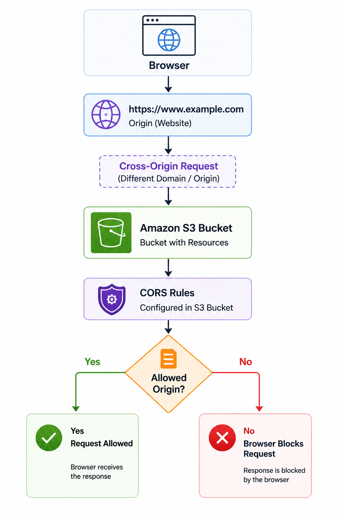

# 🌐 Cross-Origin Resource Sharing (CORS)

> Learn how Cross-Origin Resource Sharing (CORS) enables secure cross-origin access to Amazon S3 resources while protecting applications from unauthorized requests.

---

# 📖 Overview

Cross-Origin Resource Sharing (CORS) is a browser security mechanism that controls whether a web application can access resources hosted on a different origin.

By default, browsers follow the **Same-Origin Policy (SOP)**, which allows web pages to access resources only from the same origin.

Amazon S3 supports CORS by allowing bucket owners to define rules that specify which external websites can access bucket resources.

---

# 🎯 Learning Objectives

After completing this topic, you should understand:

- What CORS is
- Same-Origin Policy
- What defines an origin
- How CORS works with Amazon S3
- Common use cases
- Best practices
- Interview concepts

---

# 🌐 What is CORS?

Cross-Origin Resource Sharing (CORS) is a browser security mechanism that allows controlled access to resources hosted on a different origin.

An **origin** consists of:

- Protocol (HTTP or HTTPS)
- Domain (Host)
- Port

If any one of these values differs, the request is considered **cross-origin**.

Amazon S3 allows bucket owners to configure CORS rules that specify which origins are permitted to access bucket resources.

---

# 🏗 How CORS Works

  

---

# ⭐ Key Characteristics

- Browser security mechanism
- Based on the Same-Origin Policy
- Requests from different origins are blocked by default
- Amazon S3 supports configurable CORS rules
- Controls which origins, methods, and headers are allowed

---

# 💼 Common Use Cases

CORS is commonly used when:

- A website loads images from Amazon S3.
- JavaScript applications retrieve files from Amazon S3.
- Single Page Applications (SPAs) access S3 resources.
- Multiple websites share static assets stored in Amazon S3.

---

# ✅ Benefits

- Protects resources from unauthorized browser access.
- Allows secure communication between trusted domains.
- Supports modern web applications hosted across multiple domains.
- Improves security without restricting legitimate access.

---

# ⚠ Important Considerations

- CORS is enforced by web browsers, not by Amazon S3.
- CORS does not replace IAM Policies or Bucket Policies.
- Requests from tools such as the AWS CLI or SDK are not restricted by browser CORS rules.
- Bucket permissions must still allow access even if CORS is configured.

---

# 🔒 Best Practices

- Configure CORS only when cross-origin access is required.
- Allow only trusted origins instead of using the wildcard (`*`) whenever possible.
- Restrict allowed HTTP methods to only those required by the application.
- Follow the Principle of Least Privilege.
- Regularly review CORS configurations to remove unused origins.

---

# ❓ Frequently Asked Questions

### Q1. What is an origin?

**Answer**

An origin consists of:

- Protocol
- Domain
- Port

If any of these values differ, the request is considered cross-origin.

---

### Q2. Does Amazon S3 block cross-origin requests?

**Answer**

No.

Web browsers enforce CORS. Amazon S3 evaluates the configured CORS rules and returns the appropriate response headers.

---

### Q3. Does CORS replace Bucket Policies or IAM Policies?

**Answer**

No.

CORS controls browser access, while IAM Policies and Bucket Policies control authorization.

---

### Q4. Can AWS CLI requests be blocked by CORS?

**Answer**

No.

CORS applies only to browser-based requests.

---

### Q5. When should CORS be configured?

**Answer**

When a web application hosted on one origin needs to access Amazon S3 resources hosted on another origin.

---

# 💡 Key Takeaways

- CORS is a browser security mechanism based on the Same-Origin Policy.
- Cross-origin requests are blocked by default unless explicitly allowed.
- Amazon S3 supports configurable CORS rules for trusted origins.
- CORS improves security while enabling controlled access between different domains.
- CORS works together with IAM Policies and Bucket Policies, not as a replacement.

---

# 🧪 Related Lab

**Lab 06 – Configure CORS for an Amazon S3 Bucket**

In this lab you will:

- Create an S3 bucket
- Configure a CORS policy
- Test cross-origin access
- Validate browser behavior
- Review CORS configuration

---

# 🔗 Related Topics

- Amazon S3
- Bucket Policies
- IAM Policies
- Static Website Hosting
- Amazon CloudFront

---

# 📖 References

- AWS Documentation – Using Cross-Origin Resource Sharing (CORS)
  https://docs.aws.amazon.com/AmazonS3/latest/userguide/enabling-cors-examples.html

- MDN Web Docs – Cross-Origin Resource Sharing (CORS)
  https://developer.mozilla.org/docs/Web/HTTP/CORS