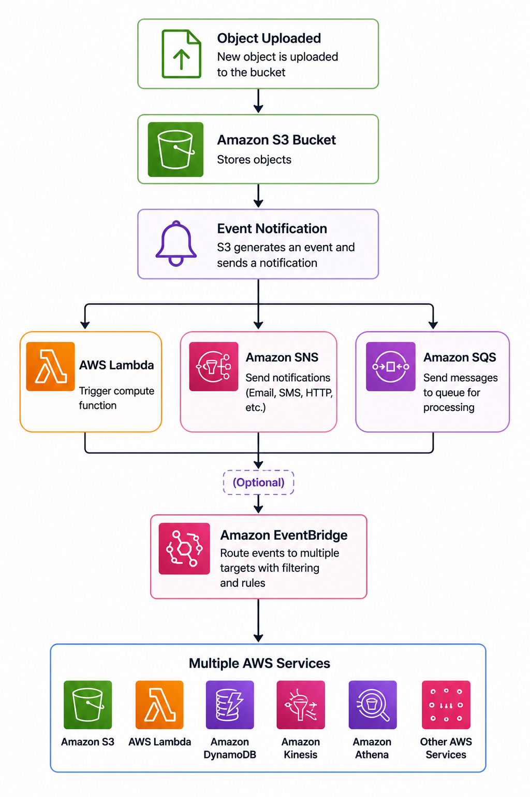

# 📩 Amazon S3 Event Notifications

> Learn how Amazon S3 Event Notifications enable event-driven architectures by automatically triggering downstream services whenever objects are created, deleted, or modified in an S3 bucket.

---

# 📖 Overview

Amazon S3 Event Notifications allow Amazon S3 to automatically notify other AWS services whenever specific events occur in a bucket.

Instead of continuously monitoring a bucket for changes, applications can react immediately when an object is uploaded, deleted, restored, or replicated.

This event-driven approach helps automate workflows and integrate Amazon S3 with other AWS services.

---

# 🎯 Learning Objectives

After completing this topic, you should understand:

- What Amazon S3 Event Notifications are
- Supported event types
- Supported notification destinations
- How Event Notifications work
- Common use cases
- Best practices
- Interview concepts

---

# 📩 What are Amazon S3 Event Notifications?

Amazon S3 Event Notifications automatically publish notifications when specific events occur in an S3 bucket.

Supported event types include:

- Object Created
  - PUT
  - POST
  - COPY
  - Complete Multipart Upload
- Object Removed
- Object Restore Completed
- Replication events

Amazon S3 can send notifications to:

- AWS Lambda
- Amazon SNS
- Amazon SQS

For more advanced event routing, Amazon S3 can also publish events to **Amazon EventBridge**.

Each destination must allow Amazon S3 to publish events through a **resource-based policy**.

---

# 🏗 How Event Notifications Work

  

---

# ⭐ Key Characteristics

- Event-driven architecture
- Automatic notifications
- Near real-time processing
- Supports multiple AWS services
- Resource-based permissions required
- Simple integration with serverless applications

---

# 💼 Common Use Cases

Amazon S3 Event Notifications are commonly used for:

- Image thumbnail generation
- File validation
- Video transcoding
- Log processing
- Data pipeline automation
- Sending notifications
- Triggering serverless workflows

---

# ✅ Benefits

- Eliminates polling
- Automates workflows
- Near real-time event processing
- Easily integrates with AWS services
- Supports scalable event-driven applications

---

# ⚠ Important Considerations

- Event Notifications are asynchronous.
- Resource-based policies are required on the destination service.
- Avoid recursive workflows, such as a Lambda function writing back to the same bucket.
- Native Event Notifications support Lambda, SNS, and SQS.
- Use Amazon EventBridge for advanced filtering and routing.

---

# 🔒 Best Practices

- Configure notifications only for the required events.
- Follow the Principle of Least Privilege when defining resource-based policies.
- Use Amazon EventBridge when events need to be routed to multiple services.
- Prevent recursive event loops.
- Monitor failed event processing using CloudWatch.

---

# ❓ Frequently Asked Questions

### Q1. Which AWS services are supported as native Event Notification destinations?

**Answer**

- AWS Lambda
- Amazon SNS
- Amazon SQS

---

### Q2. Why is a resource-based policy required?

**Answer**

It allows Amazon S3 to publish notifications to the destination service.

---

### Q3. Can Event Notifications trigger multiple services?

**Answer**

Yes.

Amazon EventBridge can route Amazon S3 events to multiple AWS services with advanced filtering capabilities.

---

### Q4. Are Event Notifications synchronous?

**Answer**

No.

Amazon S3 sends notifications asynchronously.

---

### Q5. What is the benefit of using Amazon EventBridge instead of native Event Notifications?

**Answer**

Amazon EventBridge provides:

- Advanced event filtering
- Multiple event targets
- Event archiving
- Event replay
- Integration with many AWS services and SaaS applications

---

# 💡 Key Takeaways

- Amazon S3 Event Notifications automatically trigger downstream services when bucket events occur.
- Native destinations include AWS Lambda, Amazon SNS, and Amazon SQS.
- Amazon EventBridge enables advanced event routing and filtering.
- Resource-based policies are required for destination services.
- Event Notifications help build scalable event-driven architectures.

---

# 🧪 Related Lab

**Lab 07 – Configure Amazon S3 Event Notifications**

In this lab you will:

- Create an Amazon S3 bucket
- Configure Event Notifications
- Trigger AWS Lambda from an object upload
- Verify event delivery
- Review Event Notification configuration

---

# 🔗 Related Topics

- Amazon S3
- AWS Lambda
- Amazon SNS
- Amazon SQS
- Amazon EventBridge

---

# 📖 References

- AWS Documentation – Amazon S3 Event Notifications  
  https://docs.aws.amazon.com/AmazonS3/latest/userguide/EventNotifications.html

- AWS Documentation – Configuring Event Notifications  
  https://docs.aws.amazon.com/AmazonS3/latest/userguide/notification-how-to.html

- Amazon EventBridge Documentation  
  https://docs.aws.amazon.com/eventbridge/latest/userguide/eb-what-is.html