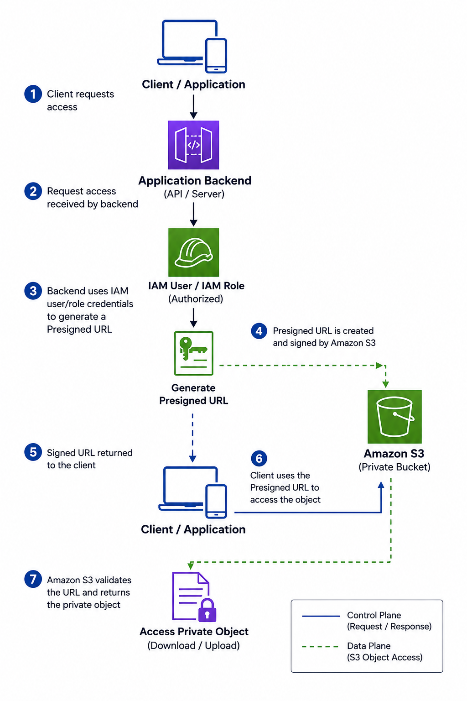
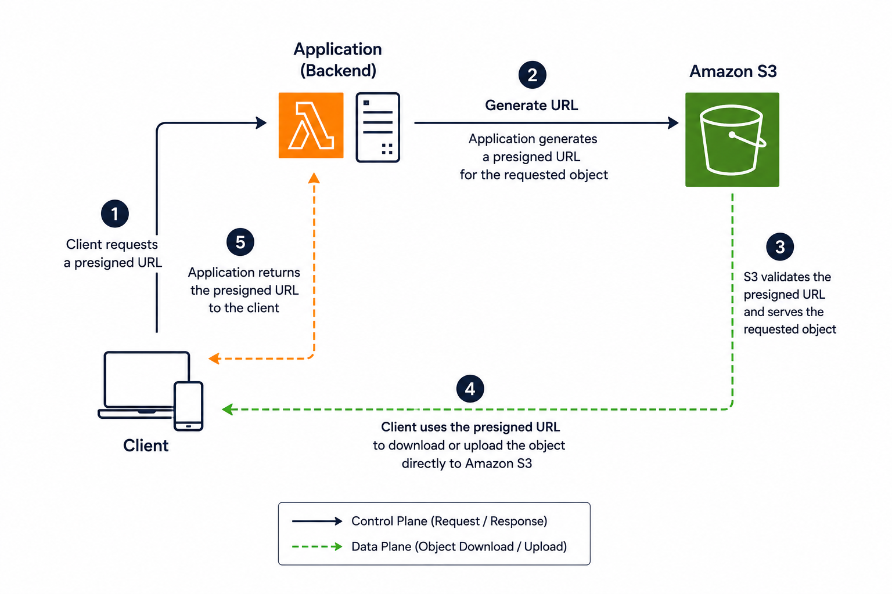

# 🔗 Amazon S3 Presigned URLs

> Learn how Amazon S3 Presigned URLs provide **secure, temporary access** to private S3 objects without making the bucket public or sharing AWS credentials.

---

# 📖 Overview

Amazon S3 Presigned URLs allow you to grant **temporary access** to a specific object in an Amazon S3 bucket.

Instead of making an object publicly accessible, an authorized AWS user or application generates a signed URL that can be shared with anyone. Anyone possessing the URL can access the object until the URL expires.

Presigned URLs are commonly used for secure file downloads, uploads, and sharing private content.

---

# 🎯 Learning Objectives

After completing this topic, you should understand:

- What Amazon S3 Presigned URLs are
- How Presigned URLs work
- Download and upload Presigned URLs
- URL expiration
- Security considerations
- Common use cases
- Best practices
- Interview concepts

---

# 🔗 What is an Amazon S3 Presigned URL?

An Amazon S3 Presigned URL is a **temporary, signed URL** that grants access to a specific object stored in a private S3 bucket.

The URL is generated using the AWS credentials of an IAM user or IAM role and contains a cryptographic signature that authorizes access to the object.

Anyone with the URL can perform the allowed operation (such as downloading or uploading the object) until the URL expires.

Unlike public objects, the object remains private throughout the process.

---

# ⚙️ How Presigned URLs Work

  

The backend application authenticates with AWS, generates the Presigned URL, and sends it to the client. The client then accesses the object directly from Amazon S3 without requiring AWS credentials.

---

# 📥 Download Presigned URL

A download Presigned URL allows users to temporarily download a private object from an S3 bucket.

### Example

1. A customer purchases an eBook.
2. The application generates a Presigned URL.
3. The customer downloads the file directly from Amazon S3.
4. After the expiration time, the URL becomes invalid.

### Common Use Cases

- Software downloads
- PDF reports
- Invoices
- Private documents
- Media files

---

# 📤 Upload Presigned URL

A Presigned URL can also allow users to upload objects directly to Amazon S3.

Instead of uploading files through your application server:

1. The application generates a Presigned URL.
2. The client uploads the file directly to Amazon S3.
3. The application server is bypassed.

### Benefits

- Reduced server load
- Faster uploads
- Lower infrastructure costs
- Improved scalability

### Common Examples

- Profile picture uploads
- Resume uploads
- Medical document uploads
- Customer attachments

---

# ⏳ URL Expiration

Every Presigned URL has an expiration time.

Once the expiration period ends:

- The URL becomes invalid.
- Amazon S3 rejects any further requests.
- A new Presigned URL must be generated.

### Maximum Expiration

| Credential Type | Maximum Expiration |
|-----------------|--------------------|
| IAM User (Signature Version 4) | Up to **7 days** |
| IAM Role / AWS STS Temporary Credentials | Limited by the credential expiration |

> **Important**
>
> If the IAM role or STS credentials expire before the configured URL expiration, the Presigned URL also becomes invalid.

---

# 🔒 Security Characteristics

- Objects remain private.
- AWS credentials are never shared with users.
- Access is limited to a specific object.
- Access is valid only for the configured duration.
- The URL includes a cryptographic signature that Amazon S3 validates before granting access.

---

# 🏗 Architecture Diagram

  

---

# 📊 Presigned URL Operations

| Operation | HTTP Method | Purpose |
|-----------|-------------|----------|
| Download Object | GET | Download a private object |
| Upload Object | PUT | Upload a new object |
| Delete Object *(Less Common)* | DELETE | Delete an object |
| Upload Form | POST | Browser-based uploads |

---

# 💼 Common Use Cases

## Secure Downloads

- Subscription content
- E-books
- Software installers
- Private reports

## Direct Uploads

- User profile images
- Resume submissions
- Customer documents
- Media uploads

## Temporary File Sharing

- Internal document sharing
- Vendor collaboration
- Temporary access for partners

## Mobile Applications

- Upload photos directly from mobile devices
- Download private application content

---

# ✅ Benefits

- Keeps S3 buckets private.
- Eliminates the need to create AWS users for customers.
- Supports both uploads and downloads.
- Reduces application server workload.
- Improves scalability.
- Easy to integrate into web and mobile applications.

---

# ⚠ Important Considerations

- A Presigned URL does **not** make an object public.
- Anyone possessing the URL can access the object until it expires.
- URLs should always be shared securely.
- Deleting or replacing the object immediately invalidates access to that object.
- Bucket policies and IAM permissions still apply when the URL is generated.
- If generated using temporary credentials, the URL cannot outlive those credentials.

---

# 🔒 Best Practices

- Use the shortest expiration time that meets business requirements.
- Generate URLs only for specific objects.
- Follow the Principle of Least Privilege for the IAM user or role generating the URL.
- Always use HTTPS when sharing Presigned URLs.
- Avoid embedding Presigned URLs permanently in websites or applications.
- Monitor access using AWS CloudTrail and S3 Server Access Logs where appropriate.
- For applications using IAM roles (such as Lambda or EC2), ensure the role's credential lifetime is sufficient for the intended URL validity.

---

# 📝 Interview Tips

### Remember these key points

✅ Presigned URLs **do not make S3 objects public.**

✅ Anyone possessing the URL can access the object until it expires.

✅ Presigned URLs support both **downloads (GET)** and **uploads (PUT)**.

✅ The URL is signed using the permissions of the IAM user or IAM role that generated it.

✅ If temporary credentials expire, the Presigned URL also expires.

---

# ❓ Frequently Asked Questions

## Q1. Does a Presigned URL make an S3 object public?

**Answer**

No.

The object remains private. The Presigned URL temporarily grants access only to users who possess the URL.

---

## Q2. Can users upload files using a Presigned URL?

**Answer**

Yes.

Presigned URLs support both downloading and uploading objects directly to Amazon S3.

---

## Q3. Can a Presigned URL access multiple objects?

**Answer**

No.

A Presigned URL is generated for a specific object and a specific operation (such as GET or PUT).

---

## Q4. What happens after the Presigned URL expires?

**Answer**

Amazon S3 denies access, and a new Presigned URL must be generated.

---

## Q5. Can a Presigned URL remain valid after temporary IAM role credentials expire?

**Answer**

No.

If the URL was generated using temporary credentials (such as an IAM role or AWS STS), it becomes invalid as soon as those credentials expire, even if the configured expiration time has not yet been reached.

---

# 💡 Key Takeaways

- Amazon S3 Presigned URLs provide temporary access to private S3 objects.
- AWS credentials are never exposed to end users.
- Presigned URLs support both object downloads and uploads.
- Objects remain private throughout the process.
- URLs automatically expire after the configured duration or when the underlying temporary credentials expire.
- Use short expiration times and least-privilege IAM permissions to improve security.

---

# 🔗 Related Topics

- Amazon S3
- Amazon S3 Bucket Policies
- AWS IAM
- IAM Roles
- AWS STS
- AWS CloudTrail
- Amazon S3 Object Ownership
- Amazon S3 Access Points

---

# 📚 References

### AWS Documentation – Sharing Objects with Presigned URLs

https://docs.aws.amazon.com/AmazonS3/latest/userguide/ShareObjectPreSignedURL.html

### AWS Documentation – Uploading Objects with Presigned URLs

https://docs.aws.amazon.com/AmazonS3/latest/userguide/PresignedUrlUploadObject.html

### AWS Documentation – Signature Version 4

https://docs.aws.amazon.com/general/latest/gr/signature-version-4.html