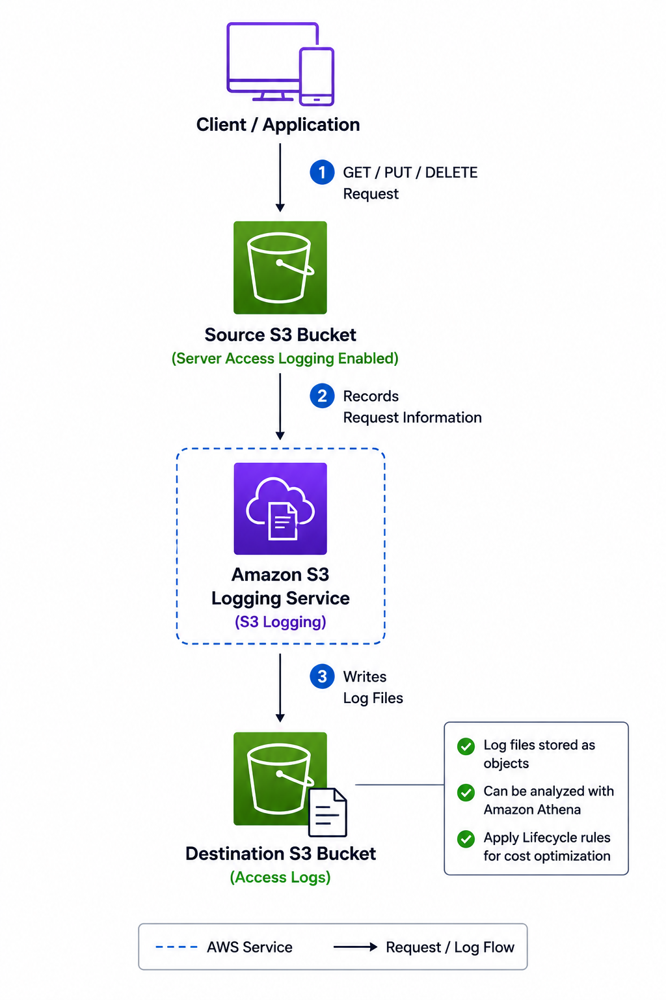

# 📋 Amazon S3 Server Access Logging

> Learn how Amazon S3 Server Access Logging records requests made to your S3 buckets for auditing, troubleshooting, security analysis, and access monitoring.

---

# 📖 Overview

Amazon S3 Server Access Logging is a feature that captures detailed information about requests made to objects in an S3 bucket.

When enabled, Amazon S3 automatically delivers access log files to a designated destination bucket. These logs help administrators monitor bucket activity, troubleshoot issues, perform security investigations, and analyze usage patterns.

Unlike AWS CloudTrail, which records AWS API activity across AWS services, **S3 Server Access Logging focuses specifically on requests made to Amazon S3 buckets and objects.**

---

# 🎯 Learning Objectives

After completing this topic, you should understand:

- What Amazon S3 Server Access Logging is
- How Server Access Logging works
- Information captured in access logs
- Common use cases
- Best practices
- S3 Server Access Logging vs AWS CloudTrail
- Interview concepts

---

# 📋 What is Amazon S3 Server Access Logging?

Amazon S3 Server Access Logging records detailed information about requests made to an S3 bucket.

When logging is enabled:

- Amazon S3 automatically generates log files.
- Log files are delivered to a specified destination bucket.
- The destination bucket must allow the Amazon S3 logging service to write log files.
- Logs are generated on a best-effort basis and may not capture every request immediately.

Each log entry contains information about a request made to your bucket or objects.

---

# ⚙️ How Server Access Logging Works

  

The source bucket records request information, and Amazon S3 periodically delivers the access logs to the configured destination bucket.

---

# 📝 Information Captured in Access Logs

Each log entry can include information such as:

- Bucket name
- Object key
- Request time
- Requester
- Source IP address
- HTTP method (GET, PUT, DELETE, etc.)
- HTTP status code
- Error code
- Bytes sent
- Object size
- Request latency
- User-Agent

This information is useful for understanding how your bucket is being accessed.

---

# 💼 Common Use Cases

### Security Auditing

- Monitor access to sensitive objects.
- Detect unauthorized access attempts.
- Investigate suspicious activity.

### Troubleshooting

- Identify failed requests.
- Analyze HTTP error codes.
- Investigate access issues.

### Access Monitoring

- Determine who accessed specific objects.
- Analyze bucket usage patterns.
- Track object downloads.

### Compliance

- Maintain access records for auditing.
- Support regulatory compliance requirements.

### Usage Analytics

- Analyze frequently accessed objects.
- Understand application access patterns.
- Support storage optimization decisions.

---

# ✅ Benefits

- Tracks requests made to S3 buckets.
- Helps troubleshoot access issues.
- Supports security investigations.
- Assists with compliance and auditing.
- Provides insights into bucket usage.
- Integrates with analytics services such as Amazon Athena.

---

# ⚠️ Important Considerations

- Server Access Logging records **requests made to Amazon S3**, not all AWS API activity.
- Log delivery is performed on a **best-effort basis** and is not guaranteed to be immediate.
- Log files themselves consume S3 storage and incur storage costs.
- Access logs should be protected because they may contain sensitive request information.
- It is recommended to store logs in a dedicated logging bucket.

---

# 🔒 Best Practices

- Store access logs in a dedicated S3 logging bucket.
- Restrict access to log files using IAM policies and bucket policies.
- Enable S3 Lifecycle rules to transition older logs to lower-cost storage classes such as:
  - S3 Glacier Flexible Retrieval
  - S3 Glacier Deep Archive
- Delete logs that are no longer required.
- Query logs using Amazon Athena instead of downloading large log files.
- Enable logging only for buckets where access monitoring is required to control storage costs.

---

# 🏗 Server Access Logging vs AWS CloudTrail

| Feature | S3 Server Access Logging | AWS CloudTrail |
|----------|--------------------------|----------------|
| Records | Requests made to S3 buckets and objects | AWS API calls across AWS services |
| Focus | Object access | AWS management and data events |
| Scope | Amazon S3 only | Multiple AWS services |
| Storage | S3 bucket | CloudTrail (optionally delivered to S3) |
| Common Use | Access monitoring and troubleshooting | Auditing, governance, and compliance |

---

# ⭐ Key Characteristics

- Records requests made to S3 buckets and objects.
- Stores log files in a destination S3 bucket.
- Generated automatically after logging is enabled.
- Delivered on a best-effort basis.
- Helps with auditing, troubleshooting, and security analysis.
- Supports lifecycle policies for cost optimization.

---

# ❓ Frequently Asked Questions

### Q1. Does S3 Server Access Logging record all AWS API calls?

**Answer**

No.

It records requests made to Amazon S3 buckets and objects only.

For AWS API calls across AWS services, use **AWS CloudTrail**.

---

### Q2. Where are S3 access logs stored?

**Answer**

They are stored in a destination Amazon S3 bucket that you configure when enabling Server Access Logging.

---

### Q3. Can the destination bucket be the same as the source bucket?

**Answer**

Yes.

However, AWS recommends using a **separate dedicated logging bucket** to simplify management and avoid unnecessary complexity.

---

### Q4. Does enabling Server Access Logging incur charges?

**Answer**

Yes.

Although there is no additional charge for enabling the feature itself, you pay for the S3 storage used to store the generated log files.

---

### Q5. Which service should I use for auditing AWS API calls?

**Answer**

Use **AWS CloudTrail**.

CloudTrail records AWS API activity across AWS services, while S3 Server Access Logging records requests made to Amazon S3 buckets and objects.

---

# 💡 Key Takeaways

- Amazon S3 Server Access Logging records requests made to S3 buckets and objects.
- Access logs are automatically delivered to a destination S3 bucket.
- The logs are useful for auditing, troubleshooting, security analysis, and usage monitoring.
- Store logs in a dedicated bucket and use Lifecycle rules to reduce storage costs.
- Use AWS CloudTrail when you need to audit AWS API activity across AWS services.

---

# 🔗 Related Topics

- Amazon S3
- Amazon S3 Bucket Policies
- Amazon S3 Lifecycle Rules
- AWS IAM
- AWS CloudTrail
- Amazon Athena
- Amazon S3 Storage Classes

---

# 📚 References

### AWS Documentation – Server Access Logging

https://docs.aws.amazon.com/AmazonS3/latest/userguide/ServerLogs.html

### AWS Documentation – Logging Requests with Server Access Logging

https://docs.aws.amazon.com/AmazonS3/latest/userguide/enable-server-access-logging.html

### AWS Documentation – AWS CloudTrail

https://docs.aws.amazon.com/awscloudtrail/latest/userguide/cloudtrail-user-guide.html